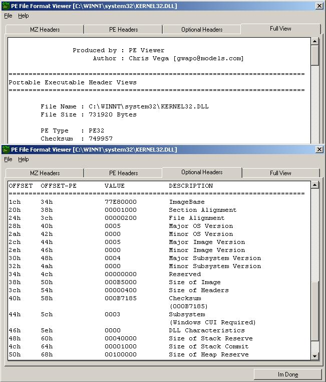



## Portable Executable \(PE\) File Header Viewer Plus Image Checksum Calculator

### Description

To study one File-Format Structure, is a "TRUE" advanced

task for a programmer, offset-by-offset and byte-by-byte

definitions, and studying the Executable Format of the

system you are working on one of this tasks.

But to study a format, you must have a Viewer and a Format

Description itself from the File-Format author/developer

or by scanning through the use of Scanners/Detectors.

Using the FileMapping Class I recently submitted to this

Server, I have created a Portable Executable Viewer, an

Application capable of:

- Has support for Portable Executable 64-Bit

- Opening and Detecting Portable Executable Type

- Recalculating Image Checksum

- View MS-DOS Compatibility Headers

- View Portable Executable Headers

- View Optional Headers

- Generating a Full Report
 
### More Info
 

             |
---                |---
**Submitted On**   |2001-10-17 03:56:44
**By**             |[Chris Vega](https://github.com/Planet-Source-Code/PSCIndex/blob/master/ByAuthor/chris-vega.md)
**Level**          |Advanced
**User Rating**    |5.0 (35 globes from 7 users)
**Compatibility**  |VB 5\.0, VB 6\.0
**Category**       |[Files/ File Controls/ Input/ Output](https://github.com/Planet-Source-Code/PSCIndex/blob/master/ByCategory/files-file-controls-input-output__1-3.md)
**World**          |[Visual Basic](https://github.com/Planet-Source-Code/PSCIndex/blob/master/ByWorld/visual-basic.md)
**Archive File**   |[Portable E2947010172001\.zip](https://github.com/Planet-Source-Code/chris-vega-portable-executable-pe-file-header-viewer-plus-image-checksum-calculator__1-28171/archive/master.zip)

